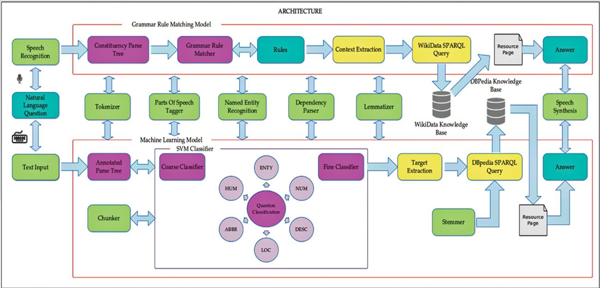

# Invoker: Natural Language Question Answering Bot

* Invoker is an open-domain QA system which answers factoid questions using context-based text mining on multiple Knowledge Bases (KB). It converts the NL question into a parse tree, understands the context and executes SPARQL query to extract answer from a KB. 
* Two techniques have been used - one of them is a grammar rule matching model which uses constituency parse trees and queries the WikiData KB, and the other one is a Machine Learning (ML) model which classifies the questions into 6 main classes employing an Support Vector Machine (SVM) classifier having 82% accuracy, performs syntactic parsing to create an annotated dependency parse tree and queries the DBpedia KB. 

### Architecuture

### Dependencies
  * Python - v2.7
  * scikit-learn - v0.18.1
  * practNLTools [link - https://github.com/biplab-iitb/practNLPTools)]
  * scipy - v0.19
  * SPARQLWrapper - v1.8.0 [link - https://pypi.python.org/pypi/SPARQLWrapper/1.8.0]
  * nltk - 3.2.2
  * sparqlquery [link - https://github.com/pudo/sparqlquery]
  * wikipedia - v1.4.0
